# Interaction Calculus

## Formalism

This calculus is based on **interaction nets**. Each node has a polarity (positive or negative). Interactions only occur between one positive node and one negative node at their **principal ports**.

### Port structure

- **Triangles** (LAM, APP, SUP, DUP, LAZ) have 3 ports:
  - One **principal port** at the vertex — used for inter-node interactions
  - Two **auxiliary ports** on the same edge (the base) — connect to other nodes
- **Non-triangles** (NUL, ERA, #) have a single port
- **Aux port polarity** indicates the polarity of the node type it connects to

### Wildcards

| Wildcard | Resolves to |
|----------|------------|
| `*` | OPX, OPY, or APP |
| `op` | OPX or OPY |
| empty triangle | APP, OPX, OPY, or DUP |

## Node types

| Node | Polarity | Aux port 1 | Aux port 2 |
|------|----------|-----------|-----------|
| **LAM** | positive | negative | positive |
| **APP** | negative | positive | negative |
| **SUP** | positive | positive | positive |
| **DUP** | negative | negative | negative |
| **LAZ** | positive | negative | positive |
| **OPX** | negative | positive | negative |
| **OPY** | negative | positive | negative |
| **NUL** | positive | — | — |
| **ERA** | negative | — | — |
| **#** | positive | — | — |
| **SUB** | negative | negative | positive |

### SUB semantics

SUB is a deferred redex — it stores a pair of terms waiting to be reduced. Its ports are only connected when the label is greater than 0. When the label is 0 (the term equals the SUB literal), nothing is connected to its ports and it acts as a no-op in interactions.

## Interaction rules

Each rule is a subgraph with a **Before** case (the redex) and an **After** case (the reduct). The numeric subscripts in the DOT source (`_1`, `_2`) are arbitrary labels with no implied ordering.

### APP/LAM

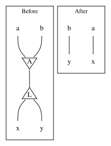

- **Before:** APP principal connects to LAM principal. APP aux ports carry `a`, `b`. LAM aux ports carry `x`, `y`.
- **After:** Direct `a → x`, `b → y` passthrough.

### ERA/LAM

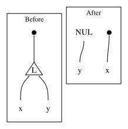

- **Before:** ERA connects to LAM principal. LAM aux ports carry `x`, `y`.
- **After:** ERA → `x`, NUL → `y`.

### APP/NUL

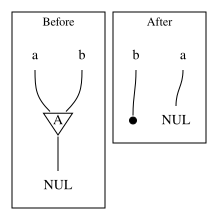

- **Before:** APP principal connects to NUL. APP aux ports carry `a`, `b`.
- **After:** `a → NUL`, `b → ERA`.

### SUB/NUL

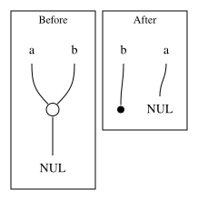

- **Before:** SUB principal connects to NUL. SUB aux ports carry `a`, `b` (only if label > 0).
- **After:** `a → NUL`, `b → ERA`.

### OP/NUL

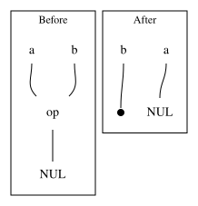

- **Before:** `op` wildcard principal connects to NUL. `op` aux ports carry `a`, `b`.
- **After:** `a → NUL`, `b → ERA`.

### OPX/NUM

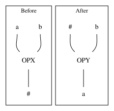

- **Before:** OPX principal connects to `#`. OPX aux ports carry `a`, `b`.
- **After:** `#` connects to OPY. OPY aux ports carry `#`, `b`. OPY principal connects to `a`.

### OPY/NUM

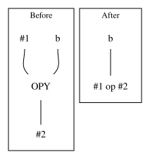

- **Before:** OPY principal connects to `#2`. OPY aux ports carry `#1`, `b`.
- **After:** `b` connects to result `#1 op #2`.

### `*/SUP`

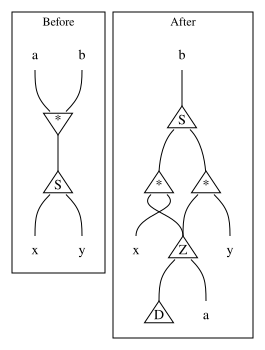
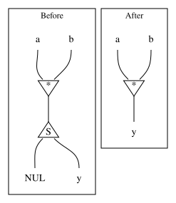
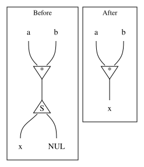

- **Before:** `*` wildcard principal connects to SUP principal. `*` aux ports carry `a`, `b`. SUP aux ports carry `x`, `y`.
- **After:** SUP principal connects to `b`. SUP aux ports connect to two LAZ nodes. Each LAZ aux port connects to a `*` wildcard. Each `*` aux port connects back to its LAZ. LAZ aux ports connect to `x`/`y`. `*` principal ports connect to LAZ. LAZ aux ports connect to DUP and `a`.
- **After (x=NUL):** SUP aux port carries NUL. `*` principal connects directly to `y`.
- **After (y=NUL):** SUP aux port carries NUL. `*` principal connects directly to `x`.

### ERA/SUP

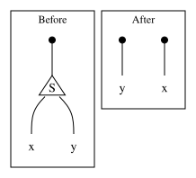

- **Before:** ERA connects to SUP principal. SUP aux ports carry `x`, `y`.
- **After:** Two ERAs connect to `x` and `y`.

### DUP/NUL

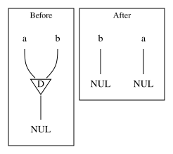

- **Before:** DUP principal connects to NUL. DUP aux ports carry `a`, `b`.
- **After:** `a → NUL`, `b → NUL`.

### DUP/NUM

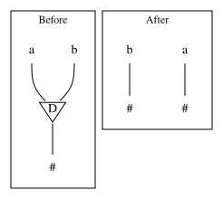

- **Before:** DUP principal connects to `#`. DUP aux ports carry `a`, `b`.
- **After:** `a → #`, `b → #`.

### DUP/LAM

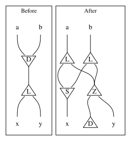

- **Before:** DUP principal connects to LAM principal. DUP aux ports carry `a`, `b`. LAM aux ports carry `x`, `y`.
- **After:** `a`, `b` each connect to a LAM. LAM aux ports connect to SUP. SUP principal connects to `x`. LAZ aux ports connect to DUP and `y`.

### DUP/SUP
DUP/SUP has two variants depending on whether the DUP and SUP labels match.

#### DUP/SUP — same labels (annihilation)

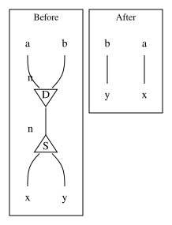

- **Before:** `D_n` principal connects to `S_n` principal. DUP aux ports carry `a`, `b`. SUP aux ports carry `x`, `y`.
- **After:** SUP aux port values wired into DUP aux ports: `x → a`, `y → b`. SUP node consumed, DUP node survives with rewired aux ports.

#### DUP/SUP — different labels (commutation/expansion)

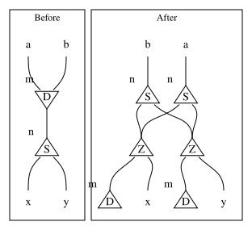

- **Before:** `D_m` principal connects to `S_n` principal (m ≠ n). DUP aux ports carry `a`, `b`. SUP aux ports carry `x`, `y`.
- **After:** `a` connects to a new `S_n`. `b` connects to a new `S_n`. Each new `S_n` aux ports connect to LAZ and DUP chains routing to `x`, `y`. The LAZ aux ports connect to DUP and the respective x/y terminals. DUP aux ports connect to LAZ and the other LAZ, forming cross-chains.

### LAZ interactions — logical rules, not physical interaction rules

**⚠️ Important:** LAZ nodes are positive-polarity but stored only in negative ports (APP port 2, DUP ports). A negative term can never interact with LAZ directly at its principal port — it always reaches LAZ through a VAR chain. Therefore these are **logical descriptions** of the reduct, not physical interaction rules in the jump table.

**Physical dispatch:**
- **ERA → LAZ**: `eraVar` → `eraseLazy` (dispatches based on thunk type)
- **Non-ERA negative → LAZ**: Through VAR chain → `negVar` dispatch

### ERA/LAZ DUP

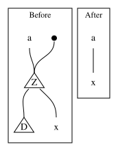

- **Before:** ERA connects to LAZ principal. `a` connects to LAZ principal. LAZ aux ports connect to `D` and `x`.
- **After:** Empty triangle principal connects to LAZ. `a`, `b` connect to empty triangle aux ports. `c` connects to LAZ principal. LAZ aux ports connect to `D` and `x`.
- **Physical handler:** `eraVar` → `eraseLazy` (DUP case with cycle detection)

### ERA/LAZ DUP (loop)

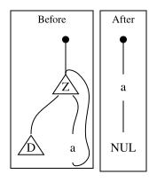

- **Before:** ERA connects to LAZ principal. `a` connects to LAZ principal. LAZ aux ports connect to `D` and `a` (looping back).
- **After:** ERA connects to `a`. `a` connects to NUL.
- **Physical handler:** `eraVar` → `eraseLazy` (DUP case with cycle detection — cycle detected)

### (APP/OPX/OPY/DUP)/LAZ DUP

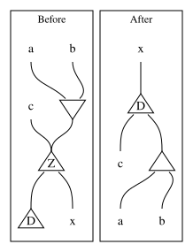

- **Before:** Empty triangle principal connects to LAZ. `a`, `b` connect to empty triangle aux ports. `c` connects to LAZ principal. LAZ aux ports connect to `D` and `x`.
- **After:** `x` connects to DUP principal. DUP aux ports connect to `c` and empty triangle principal. Empty triangle aux ports connect to `a`, `b`.
- **Physical handler:** Non-ERA negative → VAR → dispatch via `negVar` path

### ERA/LAZ (APP/OP)

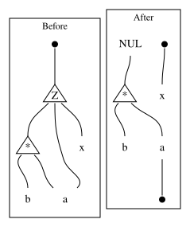

- **Before:** ERA connects to LAZ principal. LAZ aux ports connect to `*` wildcard and `x`. `*` aux ports carry `a`, `b` with a loop back to LAZ principal.
- **After:** Two ERAs connect to `x` and ERA. NUL connects to `*` wildcard principal. `*` aux ports carry `a`, `b`. `a` connects to ERA.
- **Physical handler:** `eraVar` → `eraseLazy` (APP/OP case)

### (APP/OP)/LAZ (APP/OP)

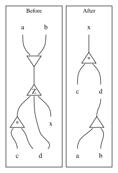

- **Before:** Empty triangle principal connects to LAZ. LAZ aux ports connect to `*` wildcard and `x`. `*` aux ports carry `c`, `d` with `d` looping back to LAZ principal.
- **After:** `x` connects to `*` wildcard principal. `*` aux ports carry `c`, `d`. Empty triangle principal connects to `d`. Empty triangle aux ports carry `a`, `b`.
- **Physical handler:** Non-ERA negative → VAR → dispatch via `negVar` path
